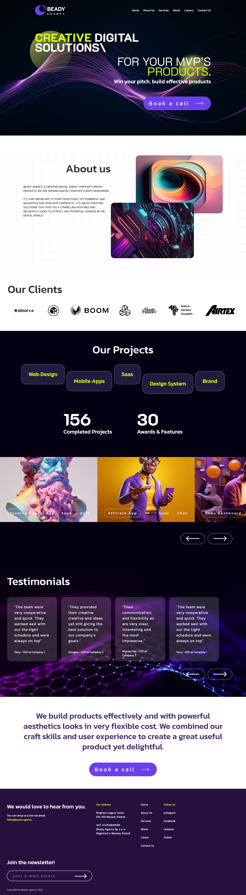

# Landing Page - Beady Agency

Landing Page Beady Agency é uma página(Landing Page) construída para demostrar conhecimentos em tecnologias básicas de front-end.

## Visão Geral

### Conceitos / Práticas aplicadas

 - O respeito às características do layout (dimensões, fontes, posicionamentos de objetos, espaçamentos, tamanhos de fontes, etc,);
- Efeitos, animações e transições de entrada e de interação nos objetos;
- Validação de formulário de cadastro de newsletter;
- Responsividade;
- Otimização de imagens;
- Performance;

### Capturas de Tela

### Links

 - [Repositório Projeto](https://github.com/Samuel-Amaro/beady-agency)
 - [Resultado](https://beady-agency.vercel.app/)

### Construído com

- Marcação HTML5 semântica
- Acessibilidade HTML com arias atributos e roles - Boas práticas APG - WCAG
- CSS(Flexbox, Grid, Bem Metodologia, Mobile-First, Responsive Web Design, Normalize)
- JavaScript(ES6+)

## Autor

- [Website](https://samuel-amaro.github.io/portfolio-web/)

